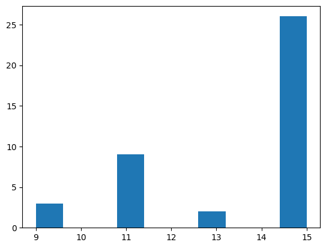
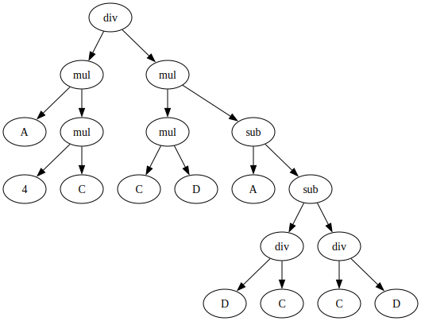

# Genetic Programming

This chapter introduces some very basic concepts about Genetic Programming. As usual, we will require a couple of imports:


```python
import random
import sys
import re
import matplotlib.pyplot as plt
from statistics import mean

# For presenting as slides
#plt.rcParams['figure.figsize'] = [12, 8]
#plt.rcParams.update({'font.size': 22})
#plt.rcParams['lines.linewidth'] = 3
```

## Classic Genetic Programming

The main difference between regular Genetic Algorithms and Genetic Programming lies in the representation: GAs tend to operate on the genotype, while GPs operate on the phenotype (programs); for this, the programs are traditionally represented as trees. Furthermore, GPs have a more open-ended nature in that the number of elements used in a solution as well as their interconnections must be open to evolution.

In a tree representation, programs are typically generated using two sets: A set of terminals (items of arity 0) and functions (items of arity > 0). The input to a function must be the result of any other function that can be defined, which leads to the important property of _type closure_: Each function must be able to handle all values it might ever receive as input, all terminals must be allowable inputs for all functions, and the output from any function must be a permitted input to any other function. 

The first step to evolving a suitable program for a given problem is thus to define the sets of functions and terminals:


```python
def add(x, y): return x + y
def sub(x, y): return x - y
def mul(x, y): return x * y
def div(x, y): return 1 if not y else x/y
```


```python
FUNCTIONS = [add, sub, mul, div]
TERMINALS = ['A', 'B', 'C', 'D']
```

### Initialisation

Our usual approach to define the presentation is by introducing code that creates random instances. Let's do the same here, except that this time we need to use a tree representation. For this, we define a suitable datastructure:


```python
class Node:
    
    def __init__(self, data=None, left=None, right=None):
        self.data = data
        self.left = left
        self.right = right

    def __str__(self):
        if self.data in FUNCTIONS:
            return self.data.__name__
        else:
            return str(self.data)
        
    def to_dot(self, dot):
        dot.node(str(id(self)), str(self))
        
        if self.left:
            left_dot = self.left.to_dot(dot)
            dot.edge(str(id(self)), str(id(self.left)))

        if self.right:
            right_dot = self.right.to_dot(dot)
            dot.edge(str(id(self)), str(id(self.right)))

        return dot      
```

The `to_dot` function is a helper function we will use in order to represent trees visually using GraphViz (which will need to be installed on your machine if you want to run this Jupyter notebook).


```python
from graphviz import Digraph
```


```python
def print_tree(tree):
    dot = Digraph()
    tree.to_dot(dot)
    return dot
```

#### Full Initialisation

A basic approach to creating random trees is to grow full trees. We decide on a maximum depth for our tree, and then add non-terminal nodes until the depth limit is reached. Once we have reached it, we only add terminals as leaves. 


```python
MAX_DEPTH = 3
```


```python
def get_random_terminal():
    return random.choice(TERMINALS)
```


```python
def get_random_function():
    return random.choice(FUNCTIONS)
```


```python
def fill_random_tree(depth=0):
    tree = Node()
    if depth < MAX_DEPTH:
        tree.data = get_random_function()
        tree.left  = fill_random_tree(depth + 1)
        tree.right = fill_random_tree(depth + 1)
    else:
        tree.data = get_random_terminal()
    return tree
```


```python
root = fill_random_tree()
print_tree(root)
```


    

    


#### Grow Initialisation


An alternative approach to filling entire trees up to their maximum depth is to grow trees of various sizes. For this we add random nodes while we haven't reached the depth limit. The resulting trees will be less bushy, but the ratio between terminals and non-terminals will bias the average size. 


```python
def grow_random_tree(depth=0):
    tree = Node()
    if depth >= MAX_DEPTH or random.random() > 0.5:
        tree.data = get_random_terminal()
    else:
        tree.data = get_random_function()
        tree.left  = grow_random_tree(depth + 1)
        tree.right = grow_random_tree(depth + 1)
    return tree
```


```python
root = grow_random_tree()
print_tree(root)
```


    

    


If the ratio of terminals to functions is high, then we might end up with many trees of size 1. To avoid this, we can define a minimum depth for the trees we want to generate, and only consider terminals once the minimum size has been reached:


```python
MIN_DEPTH = 2
```


```python
def grow_random_tree(depth=0):
    tree = Node()
    if depth < MIN_DEPTH:
        tree.data = get_random_function()
    elif depth >= MAX_DEPTH:
        tree.data = get_random_terminal()
    else:
        if random.random() > 0.5:
            tree.data = get_random_terminal()
        else:
            tree.data = get_random_function()
                
    if tree.data in FUNCTIONS:
        tree.left  = grow_random_tree(depth + 1)
        tree.right = grow_random_tree(depth + 1)
        
    return tree
```


```python
root = grow_random_tree()
print_tree(root)
```


    

    


#### Ramped Half and Half

A common practice when creating the initial population is to use a mix of filled and grown trees. For example, half the population may be initialised with the full method, and half with the grow method.


```python
population_size = 40
```


```python
def get_initial_population():
    population = []
    while len(population) < population_size:
        if random.random() < 0.5:
            population.append(fill_random_tree())
        else: 
            population.append(grow_random_tree())
        
    return population
```

By defining a helper function that calculates the size of a tree, we can look at the distribution of tree sizes:


```python
def size(tree):
    if tree.data in FUNCTIONS:
        l = size(tree.left) if tree.left else 0
        r = size(tree.right) if tree.right else 0
        return 1 + l + r
    else:
        return 1
```


```python
plt.hist([size(x) for x in get_initial_population()])
```


    (array([ 3.,  0.,  0.,  9.,  0.,  0.,  2.,  0.,  0., 26.]),
     array([ 9. ,  9.6, 10.2, 10.8, 11.4, 12. , 12.6, 13.2, 13.8, 14.4, 15. ]),
     <BarContainer object of 10 artists>)


    

    


 Sometimes this is also done using a ramped approach, to generate trees of various sizes:


```python
def get_initial_population():
    population = []
    stages = MAX_DEPTH - MIN_DEPTH + 1
    for stage in range(MIN_DEPTH, MAX_DEPTH + 1):
        for md in range(int(population_size/stages/2)):
            population.append(grow_random_tree(MAX_DEPTH - stage))
        for md in range(int(population_size/stages/2)):
            population.append(fill_random_tree(MAX_DEPTH - stage))
    return population
```


```python
plt.hist([size(x) for x in get_initial_population()])
```


    (array([ 3.,  5.,  0., 14.,  0.,  3.,  4.,  0.,  1., 10.]),
     array([ 3. ,  4.2,  5.4,  6.6,  7.8,  9. , 10.2, 11.4, 12.6, 13.8, 15. ]),
     <BarContainer object of 10 artists>)


    

    


### Ephemeral Random Constants

Our terminals only include constants (`A` etc), but in practice we might also need actual values, such as numbers. Including all possible numbers in the set of terminals does not scale well. A common approach is therefore to include _ephemeral random constants_: A single terminal represents the choice of a random value; when the terminal is chosen then it is instantiated with an actual random value:


```python
EPHEMERAL_CONSTANT = "R"
TERMINALS = ['A', 'B', 'C', 'D', EPHEMERAL_CONSTANT]
EPHEMERAL_RANGE = 5
```


```python
def get_random_terminal():
    t = random.choice(TERMINALS)
    if t == EPHEMERAL_CONSTANT:
        t = random.randint(-EPHEMERAL_RANGE, EPHEMERAL_RANGE)
    return t
```


```python
root = grow_random_tree()
print_tree(root)
```


    

    


### Search Operators

Since we have a different representation to what we used in the past (which was mainly list-based), we need to adapt our search operators.

#### Crossover

A basic approach to crossing over two trees is to randomly choose two crossover points in the parent trees, and then to cut and swap subtrees below the crossover points. We first need a function with which we can create copies of trees:


```python
def copy(tree):
    t = Node()
    t.data = tree.data
    if tree.left:  t.left = copy(tree.left)
    if tree.right: t.right = copy(tree.right)
    return t 
```

We need a couple further helper functions in order to find subtrees at chosen crossover points. First, here's a helper class that allows us to count up or down while (hackily) traversing a tree:


```python
class Counter:
    def __init__(self, num):
        self.num = num
    
    def reduce(self):
        self.num -= 1
        
    def increase(self):
        self.num += 1
    
    def is_target(self):
        return self.num == 0
    
    def greater_zero(self):
        return self.num > 0
    
    def get_value(self):
        return self.num
```

Using this helper class, we can now traverse the tree and return a copy of the subtree whenever the counter has reached the target:


```python
def get_subtree_at(tree, counter):
    counter.reduce()
    if counter.is_target():
        return copy(tree)
    else:
        ret = None
        if tree.left and counter.greater_zero(): 
            ret = get_subtree_at(tree.left, counter)
        if not ret and tree.right and counter.greater_zero(): 
            ret = get_subtree_at(tree.right, counter)
        return ret
```

Similarly, we can replace a target node with an entirely different subtree given a counter that tells us when we've reached the target node:


```python
def insert_subtree_at(tree, subtree, counter):
    counter.reduce()
    if counter.is_target():
        tree.data  = subtree.data
        tree.left  = subtree.left
        tree.right = subtree.right
    else:
        if tree.left and counter.greater_zero(): 
            insert_subtree_at(tree.left, subtree, counter)
        if tree.right and counter.greater_zero(): 
            insert_subtree_at(tree.right, subtree, counter)
```

Using these two functions we can now define a simple crossover function that picks a random subtree from one parent (`parent1`) and inserts it at a random position in the other parent (`parent2`):


```python
def subtree_crossover(parent1, parent2):
    pos1 = random.randint(1, size(parent1))
    pos2 = random.randint(1, size(parent2))
    
    if size(parent1) == 1:
        subtree = copy(parent1)
    else:
        subtree = get_subtree_at(parent1, Counter(pos1))
    offspring = copy(parent2)
    insert_subtree_at(offspring, subtree, Counter(pos2))
    
    return offspring
```

Let's create some example parents to cross over:


```python
parent1 = grow_random_tree()
print_tree(parent1)
```


    

    


```python
parent2 = grow_random_tree()
print_tree(parent2)
```


    

    


Now we can produce an offspring by calling our `crossover` function with these two parents:


```python
offspring = subtree_crossover(parent1, parent2)
print_tree(offspring)
```


    

    


Often crossover points are not actually sampled with a uniform random distribution though: Given a tree with branching factor 2 or more, the majority of nodes will be leaves, which crossover will mostly cut a single leaf. A common alternative is to apply a 90% probability of choosing a function node, and only a 10% chance of choosing a terminal node.

#### Mutation


Subtree mutation (a.k.a. headless chicken mutation) is a simple mutation where we pick a random subtree, and replace it with a randomly generated subtree:


```python
P_mutate = 0.2
```


```python
def subtree_mutation(tree):
    mutation_point = random.randint(1, size(tree))
    random_subtree = grow_random_tree(MAX_DEPTH - 2)
    insert_subtree_at(tree, random_subtree, Counter(mutation_point))
```


```python
print_tree(parent1)
```


    

    


```python
offspring = copy(parent1)
subtree_mutation(offspring)
print_tree(offspring)
```


    

    


An alternative mutation operator is _point mutation_ where, for each node, we replace the node with a certain probability with another node of the same arity.


```python
def point_mutation(tree):
    if random.random() < P_mutate:
        if tree.data in FUNCTIONS: 
            tree.data = random.choice(FUNCTIONS)
        else:
            tree.data = get_random_terminal()
    
    if tree.left:
        point_mutation(tree.left)
    if tree.right:
        point_mutation(tree.right)
```


```python
print_tree(parent1)
```


    

    


```python
offspring = copy(parent1)
point_mutation(offspring)
print_tree(offspring)
```


    

    


#### Selection


Since selection is independent of the representation, we don't need any adaptations. Since we use a variable size representation, we will include the size as one of the selection criteria.


```python
tournament_size = 3
def tournament_selection(population):
    candidates = random.sample(population, tournament_size)        
    winner = min(candidates, key=lambda x: (get_fitness(x), size(x)))
    return winner
```

An evolution step of our GA now just needs to integrate these operators:


```python
def evolution_step(population):
    new_population = []
    while len(new_population) < len(population):
        parent1 = copy(selection(population))
        parent2 = copy(selection(population))

        if random.random() < P_xover:
            offspring = crossover(parent1, parent2)
        else:
            offspring = random.choice([parent1, parent2])

        if random.random() < 0.5:
            point_mutation(offspring)
        else:
            subtree_mutation(offspring)

        new_population.append(offspring)

    population.clear()
    population.extend(new_population)

    best_fitness = min([get_fitness(k) for k in population])
    return best_fitness
```

Similarly, the overall GA is also the same as always:


```python
fitness_values = []
size_values = []
```


```python
def ga():
    population = get_initial_population()
    best_fitness = sys.maxsize
    for p in population:
        fitness = get_fitness(p)
        if fitness < best_fitness or (fitness == best_fitness and size(p) < size(best_solution)):
            best_fitness = fitness
            best_solution = copy(p)

    iteration = 0
    while iteration < max_iterations and best_fitness > 0.000001:
        fitness_values.append(best_fitness)
        size_values.append(mean([size(x) for x in population]))
        print(f"GA Iteration {iteration}, best fitness: {best_fitness}, average size: {size_values[-1]}")
        iteration += 1
        evolution_step(population)

        for p in population:
            fitness = get_fitness(p)
            if fitness < best_fitness or (fitness == best_fitness and size(p) < size(best_solution)):
                best_fitness = fitness
                best_solution = copy(p)

    print(f"GA solution after {iteration} iterations, best fitness: {best_fitness}")
    return best_solution

```

### Example Problem: Symbolic Regression

We will use symbolic regression as a first example problem. Given a set of points, we would like to come up with a symbolic expression that represents a function approximating the points. As example equation, we will use $x^2 + x + 1$.

We only have one terminal `x` for this problem, but can also include ephemeral constants:


```python
TERMINALS = ["x", EPHEMERAL_CONSTANT]
```

As fitness function for how close we are to approximating a set of points we use the sum of absolute errors for all points at different values of `x` in the range [−1.0, +1.0]. Thus, a smaller fitness value is better; a fitness of zero indicates a perfect fit. In order to calculate the error for any given point, we need a helper function that evaluates a tree for a given value of `x`:


```python
def evaluate(tree, assignment):
    if tree.data in FUNCTIONS:
        return tree.data(evaluate(tree.left, assignment), evaluate(tree.right, assignment))
    elif tree.data in assignment:
        return assignment[tree.data]
    else:
        return tree.data
```

The dictionary `assignment` will map all terminals to actual values during the evaluation. We sample a number of points for measuring the error:


```python
test_data = {}
for value in [x/10 for x in range(-10, 10)]:
    test_data[value] = value*value + value + 1
```


```python
test_data
```


    {-1.0: 1.0,
     -0.9: 0.91,
     -0.8: 0.8400000000000001,
     -0.7: 0.79,
     -0.6: 0.76,
     -0.5: 0.75,
     -0.4: 0.76,
     -0.3: 0.79,
     -0.2: 0.84,
     -0.1: 0.91,
     0.0: 1.0,
     0.1: 1.11,
     0.2: 1.24,
     0.3: 1.3900000000000001,
     0.4: 1.56,
     0.5: 1.75,
     0.6: 1.96,
     0.7: 2.19,
     0.8: 2.4400000000000004,
     0.9: 2.71}


Now calculating the fitness function reduces to calling the `evaluate` function for each points in our test set, and summing up the differences:


```python
def get_fitness(tree):
    fitness = 0.0
    
    for (x, expected_result) in test_data.items():
        assignment = {"x": x}
        result = evaluate(tree, assignment)
        fitness += (result - expected_result) * (result - expected_result)
    fitness /= len(test_data)
    
    return fitness
```

With this, we can finally call our genetic algorithm:


```python
max_iterations = 200
selection = tournament_selection
crossover = subtree_crossover
P_xover = 0.7
fitness_values = []
size_values = []
result = ga()
print_tree(result)
```

    GA Iteration 0, best fitness: 0.2926098592356817, average size: 9.5
    GA Iteration 1, best fitness: 0.2926098592356817, average size: 11.2
    GA Iteration 2, best fitness: 0.2926098592356817, average size: 12.8
    GA Iteration 3, best fitness: 0.20333000000000007, average size: 12.75
    GA Iteration 4, best fitness: 0.20333000000000007, average size: 13.75
    GA Iteration 5, best fitness: 0.20333000000000007, average size: 11.8
    GA Iteration 6, best fitness: 0.20333000000000007, average size: 9.45
    GA Iteration 7, best fitness: 0.20333000000000007, average size: 10.85
    GA Iteration 8, best fitness: 0.20333000000000007, average size: 12.75
    GA Iteration 9, best fitness: 0.20333000000000007, average size: 11.6
    GA Iteration 10, best fitness: 0.20333000000000007, average size: 12.65
    GA Iteration 11, best fitness: 0.20333000000000007, average size: 14.85
    GA Iteration 12, best fitness: 0.20333000000000007, average size: 14.65
    GA Iteration 13, best fitness: 0.20333000000000007, average size: 16.4
    GA Iteration 14, best fitness: 0.20333000000000007, average size: 17.9
    GA Iteration 15, best fitness: 0.20333000000000007, average size: 17.75
    GA Iteration 16, best fitness: 0.20333000000000007, average size: 18.05
    GA Iteration 17, best fitness: 0.20333000000000007, average size: 18.85
    GA Iteration 18, best fitness: 0.20333000000000007, average size: 17.2
    GA Iteration 19, best fitness: 0.20333000000000007, average size: 14.15
    GA Iteration 20, best fitness: 0.20333000000000007, average size: 12.4
    GA Iteration 21, best fitness: 0.20333000000000007, average size: 10.8
    GA Iteration 22, best fitness: 0.20333000000000007, average size: 11.95
    GA Iteration 23, best fitness: 0.20333000000000007, average size: 13.9
    GA Iteration 24, best fitness: 0.20333000000000007, average size: 14.45
    GA Iteration 25, best fitness: 0.20333000000000007, average size: 10.1
    GA Iteration 26, best fitness: 0.20333000000000007, average size: 12
    GA Iteration 27, best fitness: 0.20333000000000007, average size: 11.4
    GA Iteration 28, best fitness: 0.20333000000000007, average size: 10.85
    GA Iteration 29, best fitness: 0.20333000000000007, average size: 11.2
    GA Iteration 30, best fitness: 0.12676749999999998, average size: 11.55
    GA Iteration 31, best fitness: 0.12676749999999998, average size: 10.75
    GA Iteration 32, best fitness: 0.12676749999999998, average size: 10.7
    GA Iteration 33, best fitness: 0.12676749999999998, average size: 9.75
    GA Iteration 34, best fitness: 0.12676749999999998, average size: 10.55
    GA Iteration 35, best fitness: 0.12676749999999998, average size: 11.8
    GA Iteration 36, best fitness: 0.12676749999999998, average size: 10.1
    GA Iteration 37, best fitness: 0.12676749999999998, average size: 9.65
    GA Iteration 38, best fitness: 0.12676749999999998, average size: 9.25
    GA Iteration 39, best fitness: 0.12676749999999998, average size: 8.05
    GA Iteration 40, best fitness: 0.12676749999999998, average size: 9.15
    GA Iteration 41, best fitness: 0.12676749999999998, average size: 8.35
    GA Iteration 42, best fitness: 0.12676749999999998, average size: 9.5
    GA Iteration 43, best fitness: 0.12676749999999998, average size: 10.7
    GA Iteration 44, best fitness: 0.12676749999999998, average size: 13
    GA Iteration 45, best fitness: 0.12676749999999998, average size: 15
    GA Iteration 46, best fitness: 0.12676749999999998, average size: 16.05
    GA Iteration 47, best fitness: 0.12676749999999998, average size: 13.95
    GA Iteration 48, best fitness: 0.12676749999999998, average size: 14.3
    GA Iteration 49, best fitness: 0.12676749999999998, average size: 13.55
    GA Iteration 50, best fitness: 0.12676749999999998, average size: 12.85
    GA Iteration 51, best fitness: 0.12676749999999998, average size: 13.35
    GA Iteration 52, best fitness: 0.12676749999999998, average size: 10.85
    GA Iteration 53, best fitness: 0.12676749999999998, average size: 10.3
    GA Iteration 54, best fitness: 0.12676749999999998, average size: 9.4
    GA Iteration 55, best fitness: 0.12676749999999998, average size: 10.55
    GA Iteration 56, best fitness: 0.12676749999999998, average size: 10.45
    GA Iteration 57, best fitness: 0.12676749999999998, average size: 10.35
    GA Iteration 58, best fitness: 0.12676749999999998, average size: 11.3
    GA Iteration 59, best fitness: 0.12676749999999998, average size: 11.1
    GA Iteration 60, best fitness: 0.12676749999999998, average size: 8.55
    GA Iteration 61, best fitness: 0.12676749999999998, average size: 7.35
    GA Iteration 62, best fitness: 0.12676749999999998, average size: 8.3
    GA Iteration 63, best fitness: 0.12676749999999998, average size: 9.6
    GA Iteration 64, best fitness: 0.12676749999999998, average size: 8.8
    GA Iteration 65, best fitness: 0.12676749999999998, average size: 9.8
    GA Iteration 66, best fitness: 0.12676749999999998, average size: 10.75
    GA Iteration 67, best fitness: 0.12676749999999998, average size: 8.65
    GA Iteration 68, best fitness: 0.12676749999999998, average size: 9.65
    GA Iteration 69, best fitness: 0.12676749999999998, average size: 11.75
    GA Iteration 70, best fitness: 0.12676749999999998, average size: 10
    GA Iteration 71, best fitness: 0.12676749999999998, average size: 11.4
    GA Iteration 72, best fitness: 0.12676749999999998, average size: 9.45
    GA Iteration 73, best fitness: 0.12676749999999998, average size: 10.55
    GA Iteration 74, best fitness: 0.12676749999999998, average size: 9.8
    GA Iteration 75, best fitness: 0.12676749999999998, average size: 9.55
    GA Iteration 76, best fitness: 0.12676749999999998, average size: 10.2
    GA Iteration 77, best fitness: 0.12676749999999998, average size: 9.75
    GA Iteration 78, best fitness: 0.12676749999999998, average size: 8.5
    GA Iteration 79, best fitness: 0.12676749999999998, average size: 9.05
    GA Iteration 80, best fitness: 0.12676749999999998, average size: 8.85
    GA Iteration 81, best fitness: 0.12676749999999998, average size: 9.25
    GA Iteration 82, best fitness: 0.12676749999999998, average size: 12.45
    GA Iteration 83, best fitness: 0.12676749999999998, average size: 11.3
    GA Iteration 84, best fitness: 0.12676749999999998, average size: 9.85
    GA Iteration 85, best fitness: 0.12676749999999998, average size: 7.75
    GA Iteration 86, best fitness: 0.12676749999999998, average size: 9.45
    GA Iteration 87, best fitness: 0.12676749999999998, average size: 11.05
    GA Iteration 88, best fitness: 0.12676749999999998, average size: 7.95
    GA Iteration 89, best fitness: 0.12676749999999998, average size: 8.2
    GA Iteration 90, best fitness: 0.12676749999999998, average size: 9.8
    GA Iteration 91, best fitness: 0.12676749999999998, average size: 10.15
    GA Iteration 92, best fitness: 0.12676749999999998, average size: 10.55
    GA Iteration 93, best fitness: 0.12676749999999998, average size: 11.65
    GA Iteration 94, best fitness: 0.12676749999999998, average size: 10.9
    GA Iteration 95, best fitness: 0.12676749999999998, average size: 9.55
    GA Iteration 96, best fitness: 0.12676749999999998, average size: 11.4
    GA Iteration 97, best fitness: 0.12676749999999998, average size: 15.3
    GA Iteration 98, best fitness: 0.12676749999999998, average size: 13.1
    GA Iteration 99, best fitness: 0.12676749999999998, average size: 11.45
    GA Iteration 100, best fitness: 0.12676749999999998, average size: 12.4
    GA Iteration 101, best fitness: 0.12676749999999998, average size: 10.25
    GA Iteration 102, best fitness: 0.12676749999999998, average size: 9.55
    GA Iteration 103, best fitness: 0.12676749999999998, average size: 12.15
    GA Iteration 104, best fitness: 0.12676749999999998, average size: 11.2
    GA Iteration 105, best fitness: 0.12676749999999998, average size: 10.85
    GA Iteration 106, best fitness: 0.12676749999999998, average size: 9.9
    GA Iteration 107, best fitness: 0.12676749999999998, average size: 10.3
    GA Iteration 108, best fitness: 0.12676749999999998, average size: 10
    GA Iteration 109, best fitness: 0.12676749999999998, average size: 7.6
    GA Iteration 110, best fitness: 0.12676749999999998, average size: 11.15
    GA Iteration 111, best fitness: 0.12676749999999998, average size: 13.25
    GA Iteration 112, best fitness: 0.12676749999999998, average size: 11.4
    GA Iteration 113, best fitness: 0.12676749999999998, average size: 14.05
    GA Iteration 114, best fitness: 0.12676749999999998, average size: 11.5
    GA Iteration 115, best fitness: 0.12676749999999998, average size: 10.9
    GA Iteration 116, best fitness: 0.12676749999999998, average size: 11.2
    GA Iteration 117, best fitness: 0.12676749999999998, average size: 12.5
    GA Iteration 118, best fitness: 0.12676749999999998, average size: 12.6
    GA Iteration 119, best fitness: 0.12676749999999998, average size: 12.15
    GA Iteration 120, best fitness: 0.12676749999999998, average size: 8.8
    GA Iteration 121, best fitness: 0.12676749999999998, average size: 9.2


    GA Iteration 122, best fitness: 0.12676749999999998, average size: 9.2
    GA Iteration 123, best fitness: 0.12676749999999998, average size: 9.85
    GA Iteration 124, best fitness: 0.12676749999999998, average size: 10.7
    GA Iteration 125, best fitness: 0.12676749999999998, average size: 9.3
    GA Iteration 126, best fitness: 0.12676749999999998, average size: 8.1
    GA Iteration 127, best fitness: 0.12676749999999998, average size: 7.3
    GA Iteration 128, best fitness: 0.12676749999999998, average size: 7.55
    GA Iteration 129, best fitness: 0.12676749999999998, average size: 8.75
    GA Iteration 130, best fitness: 0.12676749999999998, average size: 10.4
    GA Iteration 131, best fitness: 0.12676749999999998, average size: 10.35
    GA Iteration 132, best fitness: 0.12676749999999998, average size: 10.85
    GA solution after 133 iterations, best fitness: 0.0


    

    


Is the solution actually correct? We can plot the results of this function vs the results of the actual target function to compare:


```python
points = [x/10 for x in range(-10, 11)]
real_values = [(x*x + x + 1) for x in points]
gp_values = []
for x in points:
    assignment = {}
    assignment["x"] = x
    gp_values.append(evaluate(result, assignment))
plt.plot(points, gp_values)

plt.plot(points, real_values, linestyle='--', label = "Target")
plt.plot(points, gp_values,  linestyle=':', label = "GP")
plt.legend()
```


    <matplotlib.legend.Legend at 0x12a262860>


    

    


The solution is usually correct; if it is not, try again, and maybe try to adjust the parameters of the GA.

### Handling Bloat

The solution is probably a fairly large tree. Indeed the size is sometimes quite problematic as genetic programming tends to suffer from _bloat_. Let's look at the average population size throughout the evolution:


```python
plt.plot(size_values)
```


    [<matplotlib.lines.Line2D at 0x12a24cd60>]


    

    


We have already adapted our selection operator to counter bloat somewhat, but mutation and crossover also cause an increase in size. We therefore define alternative mutation and crossover operators.

Shrink mutation replaces a random subtree with a terminal node:


```python
def shrink_mutation(individual):
    num_nodes = size(individual)
    if num_nodes < 2:
        return
    
    mutation_point = random.randint(2, num_nodes - 1)
    node = Node()
    node.data = get_random_terminal()
    insert_subtree_at(individual, node, Counter(mutation_point))
    
    return individual
```


```python
print_tree(parent1)
```


    

    


```python
offspring = copy(parent1)
shrink_mutation(offspring)
print_tree(offspring)
```


    

    


Size-fair subtree mutation first picks a random subtree, and then replaces that with a new random subtree that is at most as big as the replaced subtree:


```python
def depth(node):
    d = 0
    if node.left:
        d = max(d, depth(node.left))
    if node.right:
        d = max(d, depth(node.right))
    return d + 1
        
```


```python
def sizefair_subtree_mutation(tree):
    mutation_point = random.randint(1, size(tree))
    replaced_tree = get_subtree_at(tree, Counter(mutation_point))
    random_subtree = grow_random_tree(MAX_DEPTH - depth(replaced_tree) + 1)
    insert_subtree_at(tree, random_subtree, Counter(mutation_point))
```


```python
print_tree(parent1)
```


    

    


```python
offspring = copy(parent1)
sizefair_subtree_mutation(offspring)
print_tree(offspring)
```


    

    


Permutation mutation shuffles the order of arguments for functions with arity > 1:


```python
def permutation_mutation(tree):
    if random.random() < P_mutate:
        if tree.data in FUNCTIONS: 
            tree.left, tree.right = tree.right, tree.left
    
    if tree.left:
        permutation_mutation(tree.left)
    if tree.right:
        permutation_mutation(tree.right)
```


```python
print_tree(parent1)
```


    

    


```python
offspring = copy(parent1)
permutation_mutation(offspring)
print_tree(offspring)
```


    

    


There is also a size-fair variant of the crossover operator we defined earlier: We first pick a random crossover point in the first parent. Then, we pick a subtree in the other parent that is not larger than the subtree in the first parent, and perform the crossover with this. We thus define a helper function that gives us all valid positions with subtrees of a maximum size:


```python
def get_smaller_subtree_positions(tree, max_size, positions, counter):
    if size(tree) <= max_size:
        positions.append(counter.get_value())
    counter.increase()
    
    if tree.left:
        get_smaller_subtree_positions(tree.left, max_size, positions, counter)
    if tree.right:
        get_smaller_subtree_positions(tree.right, max_size, positions, counter)
```

We apply this helper function by simply randomly picking one of the valid positions during crossover:


```python
def sizefair_crossover(parent1, parent2):
    
    # First pick a crossover point in parent1
    pos1 = 1
    if size(parent1) > 1:
        pos1 = random.randint(1, size(parent1) - 1)

    # Then select a subtree that isn't larger than what is being replaced from parent2
    subtree = get_subtree_at(parent1, Counter(pos1))
    subtree_size = size(subtree)    
    positions = []
    get_smaller_subtree_positions(parent2, subtree_size, positions, Counter(1))
    pos2 = random.choice(positions)
    subtree = get_subtree_at(parent2, Counter(pos2))
    
    # Then insert that into parent1
    offspring = copy(parent1)
    insert_subtree_at(offspring, subtree, Counter(pos1))
    
    assert size(offspring) <= size(parent1)
    
    return offspring
```


```python
print_tree(parent1)
```


    

    


```python
print_tree(parent2)
```


    

    


```python
offspring = sizefair_crossover(parent1, parent2)
print_tree(offspring)
```


    

    


Now we just need to do some minor adaptations to make sure that these new operators are actually applied during the evolution:


```python
mutation_operators = [subtree_mutation, permutation_mutation, shrink_mutation, point_mutation, sizefair_subtree_mutation]
crossover = sizefair_crossover
```

Besides the adapted operators, another common approach is to apply an upper bound on the size, and reject offspring that exceeds that size. This can have negative implications if it is the only means to control bloat, as larger individuals will then become less likely to produce surviving offspring. However, we can use it in conjunction with out optimised operators:


```python
REJECT_SIZE = 50
```


```python
def evolution_step(population):
    new_population = []
    while len(new_population) < len(population):
        parent1 = copy(selection(population))
        parent2 = copy(selection(population))

        if random.random() < P_xover:
            offspring = crossover(parent1, parent2)
        else:
            offspring = random.choice([parent1, parent2])

        if random.random() < 0.2:
            mutation_operator = random.choice(mutation_operators)
            mutation_operator(offspring)

        if size(offspring) < REJECT_SIZE:
            new_population.append(offspring)

    population.clear()
    population.extend(new_population)

    best_fitness = min([get_fitness(k) for k in population])
    return best_fitness
```

Thus, finally, let's run the search again for the same target function.


```python
max_iterations = 200
population_size = 100
selection = tournament_selection
crossover = sizefair_crossover
P_xover = 0.7
fitness_values = []
size_values = []
result = ga()
print_tree(result)
```

    GA Iteration 0, best fitness: 0.20333000000000007, average size: 9.48
    GA Iteration 1, best fitness: 0.20333000000000007, average size: 8.36
    GA Iteration 2, best fitness: 0.20333000000000007, average size: 6.78
    GA Iteration 3, best fitness: 0.20333000000000007, average size: 5.86
    GA solution after 4 iterations, best fitness: 0.0


    

    


To validate whether we are still affected by bloat we can plot the evolution of size again:


```python
plt.plot(size_values)
```


    [<matplotlib.lines.Line2D at 0x12a3521d0>]


    

    


We can also compare the resulting function with the desired target function:


```python
points = [x/10 for x in range(-10, 11)]
real_values = [(x*x + x + 1) for x in points]
gp_values = []
for x in points:
    assignment = {}
    assignment["x"] = x
    gp_values.append(evaluate(result, assignment))
plt.plot(points, gp_values)

plt.plot(points, real_values,  linestyle='--', label = "Target")
plt.plot(points, gp_values,  linestyle=':', label = "GP")
plt.legend()
```


    <matplotlib.legend.Legend at 0x12a334ca0>


    

    


## Example Application: Fault Localisation

Given a test suite with at least one failing and at least one passing test case, the aim of fault localisation is to identify those statements in a program that are likely faulty. Intuitively, statements that are primarily executed by failed test cases are more likely to be faulty than those that are primarily executed by passed test cases. In spectrum-based fault localisation this is done by evaluating the similarity of each statement with the the error vector (i.e. the vector of pass/fail verdicts for each statement). There are many different competing similarity metrics (which we will consider in more details the Software Analysis course). 


The basis for fault localisation is a coverage matrix in which we have coverage information for each statement and each test case. These matrices serve to calculate several factors for each statement:

- $e_f$: Number of times the statement has been executed by failing tests.
- $e_p$: Number of times the statement has been executed by passing tests.
- $n_f$: Number of times the statement has _not_ been executed by failing tests.
- $n_p$: Number of times the statement has _not_ been executed by passing tests.

Based on these factors, different metrics to calculate the suspiciousness of a program statement have been defined, e.g.:

- Tarantula: $\frac{\frac{e_f}{e_f+n_f}}{\frac{e_p}{e_p+n_p} + \frac{e_f}{e_f+n_f}}$
- Barinel: $1 - \frac{e_p}{e_f + e_p}$
- Ochiai: $\frac{e_f}{\sqrt{(e_f + n_f) \cdot (e_f + e_p)}}$

The `middle` example function takes three parameters and should return the parameter that is the middle one when ranked by size.


```python
def middle(x, y, z):
    if y < z:
        if x < y:
            return y
        elif x < z:
            return y
    else:
        if x > y:
            return y
        elif x > z:
            return x
    return z
```


```python
middle(2, 3, 1)
```


    2


Our implementation of `middle` is unfortunately buggy, which we can demonstrate by generating some tests and checking the expected values.


```python
tests = []

for i in range(10):
    x = random.randrange(10)
    y = random.randrange(10)
    z = random.randrange(10)
    m = sorted([x,y,z])[1]
    tests.append((x,y,z,m))
```

Let's check if our tests can trigger a fault, otherwise we will need to generate some more:


```python
for (x,y,z,m) in tests:
    result = middle(x,y,z)
    if result != m:
        print(f"Failed test: {x},{y},{z} == {result} but should be {m}")
```

    Failed test: 2,0,7 == 0 but should be 2


We will consider the program at the level of its lines:


```python
import inspect

lines = inspect.getsource(middle).splitlines()
for i, line in enumerate(lines):
    print(f"{i}: {line}")
```

    0: def middle(x, y, z):
    1:     if y < z:
    2:         if x < y:
    3:             return y
    4:         elif x < z:
    5:             return y
    6:     else:
    7:         if x > y:
    8:             return y
    9:         elif x > z:
    10:             return x
    11:     return z


In order to apply fault localisation we need to trace test executions and keep track of which lines were executed.


```python
trace = []
```


```python
def trace_line(frame, event, arg):
    if event == "line":
        trace.append(frame.f_lineno)
    return trace_line
```


```python
def middle_instrumented(x,y,z):
    global trace
    sys.settrace(trace_line)
    trace = []
    ret = middle(x,y,z)
    sys.settrace(None)
    return ret
```


```python
middle_instrumented(1,2,3)
trace
```


    [2, 3, 4]


```python
middle_instrumented(3,4,1)
trace
```


    [2, 8, 10, 11]


Now we can derive an execution spectrum for the `middle` function using our tests.


```python
import pandas as pd
```


```python
def get_spectrum(tests, statements):
    matrix = []
    for (x,y,z,m) in tests:
        row = []
        result = middle_instrumented(x,y,z)
        for lineno in statements:
            if lineno in trace:
                row.append(1)
            else:
                row.append(0)
        if result == m:
            row.append(1)
        else:
            row.append(0)
        matrix.append(row)
    
    spectrum = pd.DataFrame(matrix, columns=statements + ["Passed"])
    return spectrum
```


```python
statements = [i for i in range(len(lines))]
```


```python
middle_spectrum = get_spectrum(tests, statements)
middle_spectrum
```


<div>
<style scoped>
    .dataframe tbody tr th:only-of-type {
        vertical-align: middle;
    }

    .dataframe tbody tr th {
        vertical-align: top;
    }

    .dataframe thead th {
        text-align: right;
    }
</style>
<table border="1" class="dataframe">
  <thead>
    <tr style="text-align: right;">
      <th></th>
      <th>0</th>
      <th>1</th>
      <th>2</th>
      <th>3</th>
      <th>4</th>
      <th>5</th>
      <th>6</th>
      <th>7</th>
      <th>8</th>
      <th>9</th>
      <th>10</th>
      <th>11</th>
      <th>Passed</th>
    </tr>
  </thead>
  <tbody>
    <tr>
      <th>0</th>
      <td>0</td>
      <td>0</td>
      <td>1</td>
      <td>0</td>
      <td>0</td>
      <td>0</td>
      <td>0</td>
      <td>0</td>
      <td>1</td>
      <td>1</td>
      <td>0</td>
      <td>0</td>
      <td>1</td>
    </tr>
    <tr>
      <th>1</th>
      <td>0</td>
      <td>0</td>
      <td>1</td>
      <td>0</td>
      <td>0</td>
      <td>0</td>
      <td>0</td>
      <td>0</td>
      <td>1</td>
      <td>1</td>
      <td>0</td>
      <td>0</td>
      <td>1</td>
    </tr>
    <tr>
      <th>2</th>
      <td>0</td>
      <td>0</td>
      <td>1</td>
      <td>1</td>
      <td>0</td>
      <td>1</td>
      <td>1</td>
      <td>0</td>
      <td>0</td>
      <td>0</td>
      <td>0</td>
      <td>0</td>
      <td>1</td>
    </tr>
    <tr>
      <th>3</th>
      <td>0</td>
      <td>0</td>
      <td>1</td>
      <td>1</td>
      <td>0</td>
      <td>1</td>
      <td>1</td>
      <td>0</td>
      <td>0</td>
      <td>0</td>
      <td>0</td>
      <td>0</td>
      <td>0</td>
    </tr>
    <tr>
      <th>4</th>
      <td>0</td>
      <td>0</td>
      <td>1</td>
      <td>0</td>
      <td>0</td>
      <td>0</td>
      <td>0</td>
      <td>0</td>
      <td>1</td>
      <td>1</td>
      <td>0</td>
      <td>0</td>
      <td>1</td>
    </tr>
    <tr>
      <th>5</th>
      <td>0</td>
      <td>0</td>
      <td>1</td>
      <td>0</td>
      <td>0</td>
      <td>0</td>
      <td>0</td>
      <td>0</td>
      <td>1</td>
      <td>0</td>
      <td>1</td>
      <td>0</td>
      <td>1</td>
    </tr>
    <tr>
      <th>6</th>
      <td>0</td>
      <td>0</td>
      <td>1</td>
      <td>1</td>
      <td>1</td>
      <td>0</td>
      <td>0</td>
      <td>0</td>
      <td>0</td>
      <td>0</td>
      <td>0</td>
      <td>0</td>
      <td>1</td>
    </tr>
    <tr>
      <th>7</th>
      <td>0</td>
      <td>0</td>
      <td>1</td>
      <td>0</td>
      <td>0</td>
      <td>0</td>
      <td>0</td>
      <td>0</td>
      <td>1</td>
      <td>0</td>
      <td>1</td>
      <td>1</td>
      <td>1</td>
    </tr>
    <tr>
      <th>8</th>
      <td>0</td>
      <td>0</td>
      <td>1</td>
      <td>0</td>
      <td>0</td>
      <td>0</td>
      <td>0</td>
      <td>0</td>
      <td>1</td>
      <td>0</td>
      <td>1</td>
      <td>1</td>
      <td>1</td>
    </tr>
    <tr>
      <th>9</th>
      <td>0</td>
      <td>0</td>
      <td>1</td>
      <td>1</td>
      <td>1</td>
      <td>0</td>
      <td>0</td>
      <td>0</td>
      <td>0</td>
      <td>0</td>
      <td>0</td>
      <td>0</td>
      <td>1</td>
    </tr>
  </tbody>
</table>
</div>


Let's calculate Barinel using this spectrum (since it's the simplest formula).


```python
def get_suspiciousness(line, spectrum):
    
    if line not in spectrum.columns:
        return 0
    
    # Number of times the statement has been executed by failing tests.
    e_f = spectrum[(spectrum["Passed"] == 0) & (spectrum[line] == 1)].size
    
    # Number of times the statement has been executed by passing tests.
    e_p = spectrum[(spectrum["Passed"] == 1) & (spectrum[line] == 1)].size

    if e_p + e_f == 0:
        return 0
    
    suspiciousness = 1 - e_p / (e_p + e_f)
        
    return suspiciousness
```


```python
lines = inspect.getsource(middle).splitlines()
for i in range(len(lines)):
    line = lines[i]
    suspiciousness = get_suspiciousness(i+1, middle_spectrum)
    print("%2d %.2f: %s" % (i, suspiciousness, line))
    
```

     0 0.00: def middle(x, y, z):
     1 0.10:     if y < z:
     2 0.25:         if x < y:
     3 0.00:             return y
     4 0.50:         elif x < z:
     5 0.50:             return y
     6 0.00:     else:
     7 0.00:         if x > y:
     8 0.00:             return y
     9 0.00:         elif x > z:
    10 0.00:             return x
    11 0.00:     return z


Indeed the `return y` in line 5 is incorrect.

To make things more challenging we will parse some example spectra based on some more complex Java classes in the format produced by the GZoltar tool.


```python
def read_matrix(matrix_file, spectra_file, faulty_line):
    line_details = []
    fh = open(spectra_file)
    num_line = 0
    for line in fh:
        num_line += 1
        if num_line == 1:
            continue
        result = line.rstrip()
        line_details.append(result)
    fh.close()

    num_statements = len(line_details)

    ep = {}
    ef = {}
    np = {}
    nf = {}

    for i in range(num_statements):
        ep[i] = 0
        ef[i] = 0
        np[i] = 0
        nf[i] = 0

    fh = open(matrix_file)
    num_test = 0
    for line in fh:
        result = line.split(" ")

        test_result = result[-1].rstrip()
        for i in range(num_statements):
            if result[i] == '1' and test_result == '+':
                ep[i] += 1
            elif result[i] == '1' and test_result == '-':
                ef[i] += 1
            elif result[i] == '0' and test_result == '+':
                np[i] += 1
            elif result[i] == '0' and test_result == '-':
                nf[i] += 1

        num_test += 1
    fh.close()

    return (ep, ef, np, nf, line_details, num_statements, faulty_line)
```

Our aim is to use GP in order to evolve a similarity function that performs better than the standard metrics. We need some datapoints for our fitness evaluation again; for this we can use some example matrices:


```python
data_files = [('data/fl/matrix.txt', 'data/fl/spectra.csv', 7),
              ('data/fl/matrix-lift.txt', 'data/fl/spectra-lift.csv', 13),
              ('data/fl/matrix-complex.txt', 'data/fl/spectra-complex.csv', 39),
              ('data/fl/matrix-rational.txt', 'data/fl/spectra-rational.csv', 10)
              ]
eval_cases = []

for (matrix, spectrum, faulty_line) in data_files:
    eval_cases.append(read_matrix(matrix, spectrum, faulty_line))
```

In the following, we will try to use GP in order to derive a formula that produces better results on our dataset than any of these well-established coefficients. This idea is described in more detail in the following paper:

Yoo, S. (2012, September). Evolving human competitive spectra-based fault localisation techniques. In International Symposium on Search Based Software Engineering (pp. 244-258). Springer, Berlin, Heidelberg.

Similar to the existing coefficients, the components of our formula shall be simple arithmetic operations:


```python
def add(x, y): return x + y
def sub(x, y): return x - y
def mul(x, y): return x * y
def div(x, y): return 1 if not y else x/y
```


```python
FUNCTIONS = [add, sub, mul, div]
```

The terminals will be the factors listed above, as well as the constant 1:


```python
TERMINALS = ['ep', 'ef', 'np', 'nf', 1]
```

In order to evaluate the fitness of a particular formula, we apply it to our four (faulty) example programs, rank the statements by their suspiciousness, and then report the position at which the faulty statement is ranked. A perfect fault localisation means that the faulty statement is listed first. In case of ties, where multiple statements have the same suspiciousness score, we calculate the average position of the statements with the same suspiciousness:


```python
def get_fitness(tree):
    positions = []
    for (ep, ef, np, nf, line_details, num_statements, faulty_line) in eval_cases:
        lines = [line for line in range(num_statements)]
        weights = []
        for line in lines:
            assignment = {"np": np[line], 
                          "nf": nf[line], 
                          "ep": ep[line],
                          "ef": ef[line]}
            result = evaluate(tree, assignment)
            weights.append(result)
        lines, weights = zip(*sorted(zip(lines, weights), key=lambda t: t[1], reverse=True))

        start = lines.index(faulty_line)
        end = start
        faulty_weight = weights[start]
        while end < len(weights) and faulty_weight == weights[end]:
            end += 1

        positions.append((start + end)/2)
        
    return sum(positions)/len(positions)
```

In order to compare different ranking formulas, we will also look at the top 5 statements for each example:


```python
def print_ranking(tree):
    for (ep, ef, np, nf, line_details, num_statements, faulty_line) in eval_cases:
        lines = [line for line in range(num_statements)]
        weights = []
        for line in lines:
            assignment = {"np": np[line], 
                          "nf": nf[line], 
                          "ep": ep[line],
                          "ef": ef[line]}
            result = evaluate(tree, assignment)
            weights.append(result)

        lines, weights = zip(*sorted(zip(lines, weights), key=lambda t: t[1], reverse=True))

        print(f"Faulty line: {faulty_line}: {lines[:5]}")
```

Before evolving our own suspiciousness formula, let's express some standard formulas using our tree datastructure:

Tarantula: $\frac{\frac{e_f}{e_f+n_f}}{\frac{e_p}{e_p+n_p} + \frac{e_f}{e_f+n_f}}$


```python
tarantula = Node(div,
                 Node(div, Node('ef'), Node(add, Node('ef'), Node('nf'))),
                 Node(add, Node(div, Node('ep'), Node(add, Node('ep'), Node('np'))),
                           Node(div, Node('ef'), Node(add, Node('ef'), Node('nf'))))
                )
print_tree(tarantula)
```


    

    


Barinel: $1 - \frac{e_p}{e_f + e_p}$


```python
barinel = Node(sub, Node(1), Node(div, Node('ep'), Node(add, Node('ef'), Node('ep'))))
print_tree(barinel)
```


    

    


Barinel should perform better than Tarantula:


```python
get_fitness(tarantula)
```


    13.625


```python
get_fitness(barinel)
```


    6.625


But can we do better?


```python
max_iterations = 50
population_size = 50
selection = tournament_selection
crossover = sizefair_crossover
P_xover = 0.7
fitness_values = []
size_values = []
result = ga()
```

    GA Iteration 0, best fitness: 8.5, average size: 9.333333333333334
    GA Iteration 1, best fitness: 4.0, average size: 9.458333333333334
    GA Iteration 2, best fitness: 4.0, average size: 7.958333333333333
    GA Iteration 3, best fitness: 2.75, average size: 9.916666666666666
    GA Iteration 4, best fitness: 2.5, average size: 9.666666666666666
    GA Iteration 5, best fitness: 2.5, average size: 9.666666666666666
    GA Iteration 6, best fitness: 2.5, average size: 9.666666666666666
    GA Iteration 7, best fitness: 2.5, average size: 10.708333333333334
    GA Iteration 8, best fitness: 2.5, average size: 10.333333333333334
    GA Iteration 9, best fitness: 2.5, average size: 9.208333333333334
    GA Iteration 10, best fitness: 2.5, average size: 10.541666666666666
    GA Iteration 11, best fitness: 2.5, average size: 11.291666666666666
    GA Iteration 12, best fitness: 2.5, average size: 11.708333333333334
    GA Iteration 13, best fitness: 2.5, average size: 11.333333333333334
    GA Iteration 14, best fitness: 2.5, average size: 9.958333333333334
    GA Iteration 15, best fitness: 2.5, average size: 9.958333333333334
    GA Iteration 16, best fitness: 2.5, average size: 9.5
    GA Iteration 17, best fitness: 2.5, average size: 9.583333333333334
    GA Iteration 18, best fitness: 2.5, average size: 8.333333333333334
    GA Iteration 19, best fitness: 2.5, average size: 8.208333333333334
    GA Iteration 20, best fitness: 2.5, average size: 8
    GA Iteration 21, best fitness: 2.5, average size: 7.875
    GA Iteration 22, best fitness: 2.5, average size: 7.625
    GA Iteration 23, best fitness: 2.5, average size: 8.666666666666666
    GA Iteration 24, best fitness: 2.5, average size: 8.75
    GA Iteration 25, best fitness: 2.5, average size: 8.416666666666666
    GA Iteration 26, best fitness: 2.5, average size: 8.458333333333334
    GA Iteration 27, best fitness: 2.5, average size: 7.375
    GA Iteration 28, best fitness: 2.5, average size: 8.041666666666666
    GA Iteration 29, best fitness: 2.5, average size: 7.875
    GA Iteration 30, best fitness: 2.5, average size: 9.041666666666666
    GA Iteration 31, best fitness: 2.5, average size: 9.166666666666666
    GA Iteration 32, best fitness: 2.5, average size: 9.708333333333334
    GA Iteration 33, best fitness: 2.5, average size: 8.125
    GA Iteration 34, best fitness: 2.5, average size: 9.041666666666666
    GA Iteration 35, best fitness: 2.5, average size: 9.083333333333334
    GA Iteration 36, best fitness: 2.5, average size: 8.916666666666666
    GA Iteration 37, best fitness: 2.5, average size: 9.958333333333334
    GA Iteration 38, best fitness: 2.5, average size: 9.708333333333334
    GA Iteration 39, best fitness: 2.5, average size: 9
    GA Iteration 40, best fitness: 2.5, average size: 8.916666666666666
    GA Iteration 41, best fitness: 2.5, average size: 8.5
    GA Iteration 42, best fitness: 2.5, average size: 7.416666666666667
    GA Iteration 43, best fitness: 2.5, average size: 8.333333333333334
    GA Iteration 44, best fitness: 2.5, average size: 8.916666666666666
    GA Iteration 45, best fitness: 2.5, average size: 8.916666666666666
    GA Iteration 46, best fitness: 2.5, average size: 9.291666666666666
    GA Iteration 47, best fitness: 2.5, average size: 8.333333333333334
    GA Iteration 48, best fitness: 2.5, average size: 9.625
    GA Iteration 49, best fitness: 2.5, average size: 9.541666666666666
    GA solution after 50 iterations, best fitness: 2.5


```python
print_tree(result)
```


    

    


```python
get_fitness(result)
```


    2.5


Let's now compare the results of the standard metrics and our new one by looking at the top 5 most suspicious statements for each of the coefficients:


```python
print_ranking(tarantula)
```

    Faulty line: 7: (7, 17, 11, 6, 8)
    Faulty line: 13: (6, 7, 8, 13, 18)
    Faulty line: 39: (38, 39, 40, 42, 23)
    Faulty line: 10: (9, 11, 12, 46, 48)


```python
print_ranking(barinel)
```

    Faulty line: 7: (7, 11, 6, 8, 9)
    Faulty line: 13: (13, 0, 1, 2, 3)
    Faulty line: 39: (38, 39, 40, 42, 23)
    Faulty line: 10: (9, 72, 70, 71, 63)


```python
print_ranking(result)
```

    Faulty line: 7: (7, 11, 10, 9, 0)
    Faulty line: 13: (13, 9, 10, 11, 15)
    Faulty line: 39: (38, 39, 40, 42, 0)
    Faulty line: 10: (9, 6, 7, 8, 10)


The ranking is clearly better overall given these four example spectra. Obviously this isn't a really fair comparison, however, since we are measuring the performance on the training data. For more details of how this generalises, please refer to the original paper.
